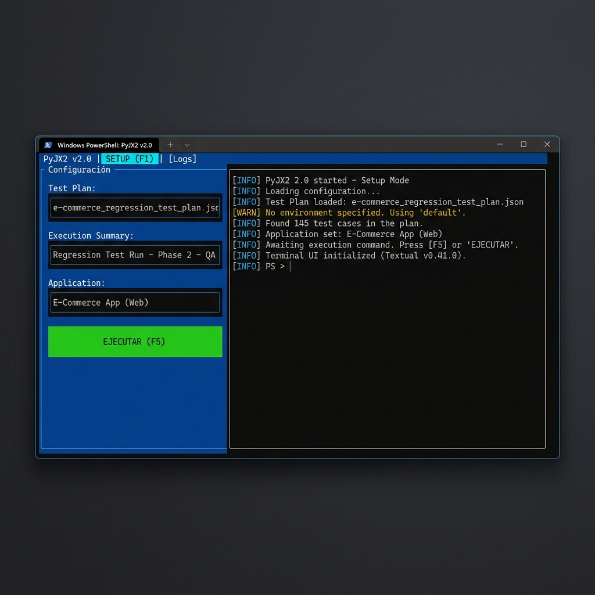
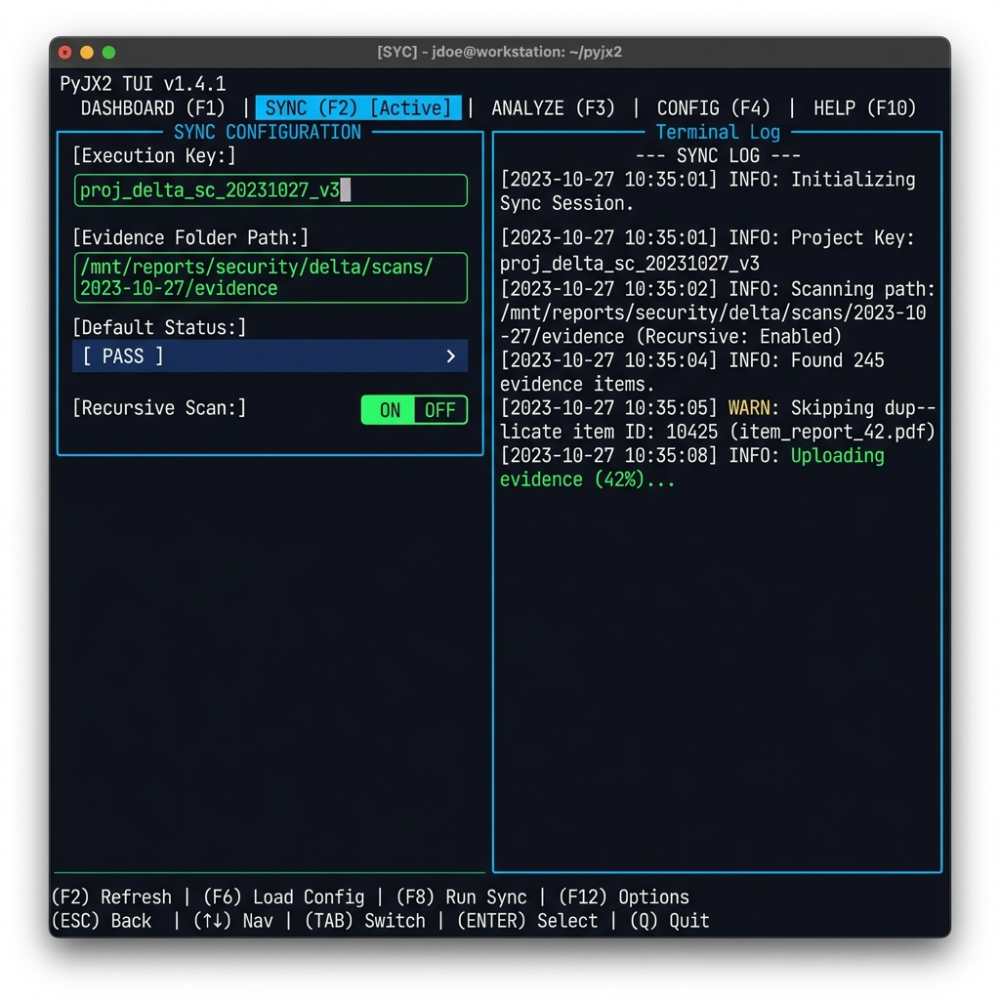
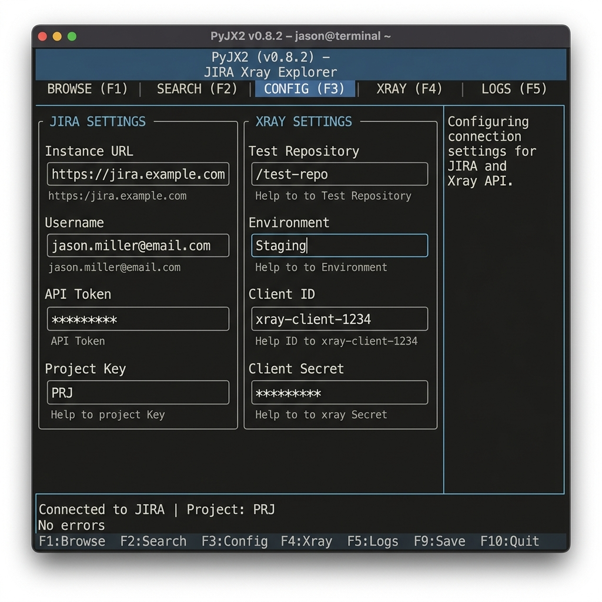
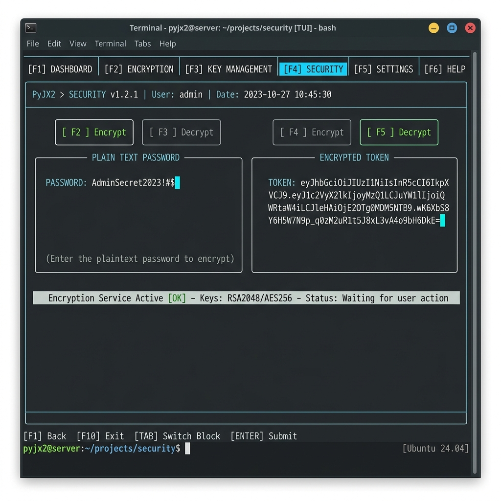

# Interfaz Gráfica (TUI)

PYJX2 cuenta con una interfaz gráfica basada en terminal (Terminal User Interface) diseñada para facilitar la operación sin necesidad de recordar comandos complejos. Se invoca con:

```bash
pyjx2 tui
```

## Navegación y Uso
- **Pestañas (F1 - F4)**: Cambia entre las diferentes herramientas de la aplicación.
- **Teclado**: Usa `TAB` y `Shift+TAB` para navegar entre campos, y `Enter` o `Espacio` para activar botones.
- **Ratón**: Soporta clics directos sobre botones y campos de entrada.

---

## Pestaña F1: Preparación (Setup)
Esta pestaña permite configurar la jerarquía de ejecución en Jira.



**Proceso de Uso:**
- Ingresa la **Llave del Test Plan**.
- Define un **Título para la Ejecución** y el **Test Set**.
- Selecciona la **Aplicación** (ej. AXA_WEB).
- Elige el **Modo de Test** (`clone` para replicar o `add` para añadir).
- Haz clic en **Ejecutar**. Podrás seguir el progreso en tiempo real en la caja de logs inferior.

---

## Pestaña F2: Sincronización (Sync)
Ideal para subir evidencias masivas desde tu computadora a Jira.



**Proceso de Uso:**
- Pega la **Llave de la Ejecución** (Test Execution).
- Selecciona la **Carpeta local** donde tienes tus capturas o PDFs.
- Elige el **Estado por defecto** que se aplicará a los casos encontrados.
- Ajusta las opciones de **Escaneo Recursivo**.
- Presiona **Ejecutar** para iniciar la carga.

---

## Pestaña F3: Configuración (Config)
A diferencia de la CLI, esta pestaña actúa como un almacén de configuración en memoria.



**Detalles:**
- Puedes definir aquí tus credenciales de **Jira** y **Xray**.
- Estos valores se mantendrán durante toda la sesión de la TUI, permitiéndote cambiar de pestaña sin perder la conexión.
- No es necesario editar archivos `.toml` mientras uses esta interfaz.

---

## Pestaña F4: Seguridad (Security)
Herramientas para la gestión de tokens y contraseñas.



**Utilidad:**
- **Encriptar**: Pega tu contraseña plana y obtén el string `ENC:...` para guardarlo en tus archivos externos de forma segura.
- **Desencriptar**: Valida el contenido de un token cifrado preexistente.

---

## Ayuda y Documentación
En la parte inferior de la TUI encontrarás el botón **📖 Visualizar Documentación (MkDocs)**. Al pulsarlo, se lanzará automáticamente este manual en tu navegador Chrome para consulta inmediata.
